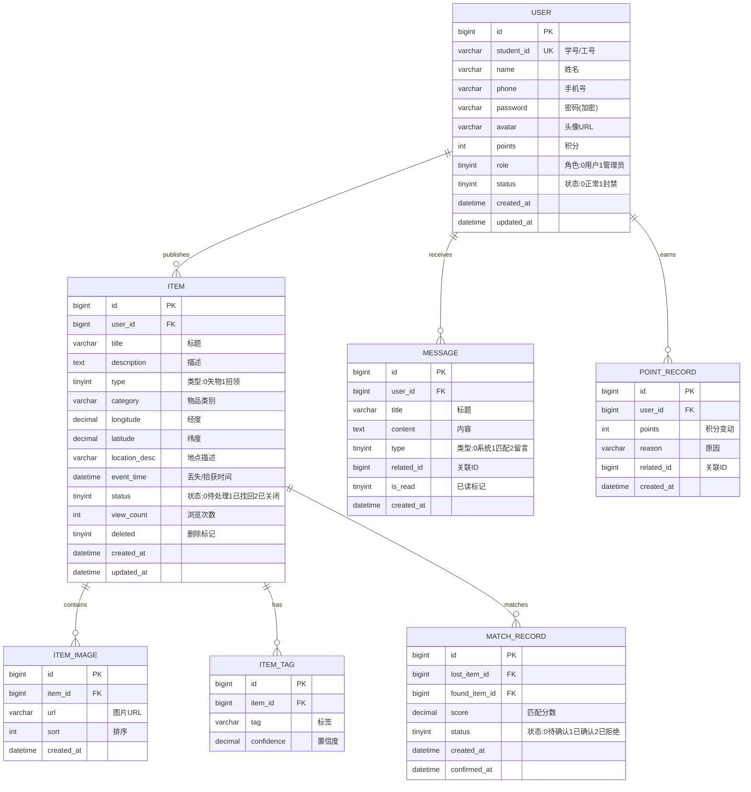

# 设计文档

## 概述

智能校园失物招领平台采用前后端分离架构，后端基于Spring Boot框架构建RESTful API服务，前端使用Vue.js框架实现响应式Web应用。系统整合阿里云视觉智能图像识别、高德地图LBS服务、阿里云OSS存储等第三方服务，通过MySQL存储业务数据，Redis实现缓存和会话管理，构建一个高效、智能的失物招领解决方案。

## 架构设计

### 整体架构

```
┌─────────────────────────────────────────────────────────────────┐
│                        客户端层                                  │
│  ┌─────────────────┐  ┌─────────────────┐  ┌─────────────────┐ │
│  │   Web浏览器      │  │   移动端H5      │  │   管理后台       │ │
│  └────────┬────────┘  └────────┬────────┘  └────────┬────────┘ │
└───────────┼─────────────────────┼─────────────────────┼─────────┘
            │                     │                     │
            └─────────────────────┼─────────────────────┘
                                  │ HTTP/WebSocket
┌─────────────────────────────────┼───────────────────────────────┐
│                        网关层    │                               │
│  ┌──────────────────────────────┴──────────────────────────────┐│
│  │                    Nginx反向代理                             ││
│  │              (负载均衡、静态资源、SSL)                        ││
│  └──────────────────────────────┬──────────────────────────────┘│
└─────────────────────────────────┼───────────────────────────────┘
                                  │
┌─────────────────────────────────┼───────────────────────────────┐
│                        应用层    │                               │
│  ┌──────────────────────────────┴──────────────────────────────┐│
│  │                Spring Boot Application                       ││
│  │  ┌─────────────┐ ┌─────────────┐ ┌─────────────┐            ││
│  │  │ Controller  │ │  Service    │ │ Repository  │            ││
│  │  │    层       │ │    层       │ │    层       │            ││
│  │  └─────────────┘ └─────────────┘ └─────────────┘            ││
│  └─────────────────────────────────────────────────────────────┘│
└─────────────────────────────────────────────────────────────────┘
                                  │
┌─────────────────────────────────┼───────────────────────────────┐
│                        数据层    │                               │
│  ┌─────────────┐  ┌─────────────┴─┐  ┌─────────────┐           │
│  │   MySQL     │  │    Redis      │  │ 阿里云OSS   │           │
│  │  主数据库    │  │   缓存/会话   │  │  文件存储   │           │
│  └─────────────┘  └───────────────┘  └─────────────┘           │
└─────────────────────────────────────────────────────────────────┘
                                  │
┌─────────────────────────────────┼───────────────────────────────┐
│                      第三方服务层 │                              │
│  ┌─────────────┐  ┌─────────────┴─┐  ┌─────────────┐           │
│  │ 阿里云视觉智能 │  │  高德地图API  │  │  短信服务   │           │
│  │  图像识别      │  │   LBS服务     │  │  (可选)     │           │
│  └─────────────┘  └───────────────┘  └─────────────┘           │
└─────────────────────────────────────────────────────────────────┘
```

### 技术栈

| 层级 | 技术选型 | 说明 |
|------|----------|------|
| 前端框架 | Vue 3 + Vite | 响应式前端框架 |
| UI组件库 | Element Plus | Vue 3 UI组件库 |
| 状态管理 | Pinia | Vue 3状态管理 |
| 后端框架 | Spring Boot 3.x | Java后端框架 |
| ORM框架 | MyBatis-Plus | 数据库访问层 |
| 数据库 | MySQL 8.0 | 关系型数据库 |
| 缓存 | Redis 7.x | 缓存和会话存储 |
| 文件存储 | 阿里云OSS | 图片文件存储 |
| 认证 | JWT + Spring Security | 身份认证授权 |
| API文档 | Swagger/OpenAPI | 接口文档 |

## 组件与接口

### 后端模块划分

```
src/main/java/com/campus/lostandfound/
├── config/                 # 配置类
│   ├── SecurityConfig.java
│   ├── RedisConfig.java
│   ├── OssConfig.java
│   └── WebSocketConfig.java
├── controller/             # 控制器层
│   ├── AuthController.java
│   ├── UserController.java
│   ├── ItemController.java
│   ├── MatchController.java
│   ├── MessageController.java
│   ├── PointController.java
│   └── AdminController.java
├── service/                # 服务层
│   ├── AuthService.java
│   ├── UserService.java
│   ├── ItemService.java
│   ├── ImageRecognitionService.java
│   ├── LocationService.java
│   ├── MatchService.java
│   ├── MessageService.java
│   ├── PointService.java
│   └── FileService.java
├── repository/             # 数据访问层
│   ├── UserMapper.java
│   ├── ItemMapper.java
│   ├── MatchMapper.java
│   ├── MessageMapper.java
│   └── PointMapper.java
├── model/                  # 数据模型
│   ├── entity/
│   ├── dto/
│   └── vo/
├── common/                 # 公共组件
│   ├── Result.java
│   ├── PageResult.java
│   └── Constants.java
├── exception/              # 异常处理
│   └── GlobalExceptionHandler.java
├── util/                   # 工具类
│   ├── JwtUtil.java
│   └── RedisUtil.java
└── websocket/              # WebSocket
    └── MessageWebSocket.java
```

### 核心接口定义

#### 认证接口
```java
public interface AuthService {
    // 用户注册
    Result<UserVO> register(RegisterDTO dto);
    // 用户登录
    Result<TokenVO> login(LoginDTO dto);
    // 刷新令牌
    Result<TokenVO> refreshToken(String refreshToken);
    // 退出登录
    Result<Void> logout(String token);
}
```

#### 物品信息接口
```java
public interface ItemService {
    // 发布失物/招领信息
    Result<ItemVO> publish(ItemDTO dto, Long userId);
    // 更新信息
    Result<ItemVO> update(Long id, ItemDTO dto, Long userId);
    // 删除信息（软删除）
    Result<Void> delete(Long id, Long userId);
    // 获取详情
    Result<ItemVO> getDetail(Long id);
    // 搜索列表
    Result<PageResult<ItemVO>> search(ItemSearchDTO dto);
    // 获取附近信息
    Result<List<ItemVO>> getNearby(Double lng, Double lat, Integer radius);
}
```

#### 智能匹配接口
```java
public interface MatchService {
    // 执行匹配计算
    List<MatchResult> calculateMatch(Item item);
    // 获取匹配推荐
    Result<List<MatchVO>> getRecommendations(Long itemId);
    // 确认匹配
    Result<Void> confirmMatch(Long itemId, Long matchedItemId, Long userId);
    // 反馈匹配结果
    Result<Void> feedback(MatchFeedbackDTO dto);
}
```

#### 图像识别接口
```java
public interface ImageRecognitionService {
    // 识别图片内容
    RecognitionResult recognize(String imageUrl);
    // 提取物品特征标签
    List<String> extractTags(String imageUrl);
    // 获取物品类别
    String getCategory(String imageUrl);
}
```

#### 地理位置接口
```java
public interface LocationService {
    // 地址转坐标
    GeoPoint geocode(String address);
    // 坐标转地址
    String reverseGeocode(Double lng, Double lat);
    // 计算距离
    Double calculateDistance(GeoPoint p1, GeoPoint p2);
    // 范围查询
    List<Long> searchInRadius(Double lng, Double lat, Integer radius);
}
```

## 数据模型

### ER图



### 核心实体类

```java
@Data
@TableName("user")
public class User {
    @TableId(type = IdType.AUTO)
    private Long id;
    private String studentId;
    private String name;
    private String phone;
    private String password;
    private String avatar;
    private Integer points;
    private Integer role;  // 0:普通用户 1:管理员
    private Integer status; // 0:正常 1:封禁
    private LocalDateTime createdAt;
    private LocalDateTime updatedAt;
}

@Data
@TableName("item")
public class Item {
    @TableId(type = IdType.AUTO)
    private Long id;
    private Long userId;
    private String title;
    private String description;
    private Integer type;  // 0:失物 1:招领
    private String category;
    private BigDecimal longitude;
    private BigDecimal latitude;
    private String locationDesc;
    private LocalDateTime eventTime;
    private Integer status; // 0:待处理 1:已找回 2:已关闭
    private Integer viewCount;
    private Integer deleted;
    private LocalDateTime createdAt;
    private LocalDateTime updatedAt;
}
```


## 正确性属性

*属性是指在系统所有有效执行中都应保持为真的特征或行为——本质上是关于系统应该做什么的形式化陈述。属性是人类可读规范与机器可验证正确性保证之间的桥梁。*

### Property 1: 用户注册数据完整性
*对于任意*有效的注册信息（学号、姓名、手机号、密码），注册成功后查询该用户应返回相同的基本信息（密码除外）
**Validates: Requirements 1.1**

### Property 2: 登录认证往返一致性
*对于任意*已注册用户，使用正确的凭据登录应返回有效的JWT令牌，使用该令牌访问受保护资源应成功
**Validates: Requirements 1.2, 10.1**

### Property 3: 用户信息更新权限验证
*对于任意*用户A和用户B（A≠B），用户A尝试更新用户B的信息应被拒绝，只有用户自己才能更新自己的信息
**Validates: Requirements 1.3, 2.4**

### Property 4: 物品信息发布往返一致性
*对于任意*有效的物品信息（标题、描述、类型、位置等），发布后查询该物品应返回相同的信息内容
**Validates: Requirements 2.1**

### Property 5: 软删除数据保留
*对于任意*已发布的物品信息，删除操作后该信息应标记为已删除状态，但数据库中仍保留原始数据
**Validates: Requirements 2.5**

### Property 6: 浏览计数单调递增
*对于任意*物品信息，每次查看详情后浏览次数应比查看前增加1
**Validates: Requirements 2.6**

### Property 7: 图片压缩阈值处理
*对于任意*大于5MB的图片文件，上传处理后的图片大小应小于或等于5MB
**Validates: Requirements 3.5**

### Property 8: 地理范围查询准确性
*对于任意*中心点坐标和搜索半径，返回的所有物品信息的位置与中心点的距离应不超过指定半径
**Validates: Requirements 4.3**

### Property 9: 匹配分数计算一致性
*对于任意*两个物品信息，多次计算匹配分数应返回相同的结果（确定性算法）
**Validates: Requirements 5.1**

### Property 10: 匹配推荐排序正确性
*对于任意*物品信息的匹配推荐列表，返回结果应按匹配度降序排列，且数量不超过10条
**Validates: Requirements 5.3**

### Property 11: 匹配确认状态同步
*对于任意*匹配确认操作，双方物品信息的状态应同时更新为"已找回"
**Validates: Requirements 5.4**

### Property 12: 消息列表时间排序
*对于任意*用户的消息列表，返回结果应按创建时间降序排列
**Validates: Requirements 6.3**

### Property 13: 消息已读状态更新
*对于任意*未读消息，查看后该消息的已读状态应更新为true
**Validates: Requirements 6.4**

### Property 14: 积分奖励正确性
*对于任意*触发积分奖励的操作（匹配成功+50、发布招领+10、每日登录+2），用户积分应增加对应数值，且积分记录应正确记录变动原因
**Validates: Requirements 7.1, 7.2, 7.3, 7.4**

### Property 15: 积分排行榜排序正确性
*对于任意*积分排行榜查询，返回结果应按积分总数降序排列，且数量不超过100条
**Validates: Requirements 7.5**

### Property 16: 搜索结果相关性
*对于任意*关键词搜索，返回的所有物品信息的标题、描述或标签中应包含该关键词
**Validates: Requirements 8.1**

### Property 17: 筛选条件准确性
*对于任意*筛选条件组合（类别、时间范围、地点范围、状态），返回的所有物品信息应满足所有指定条件
**Validates: Requirements 8.2**

### Property 18: 分页大小限制
*对于任意*分页查询，每页返回的记录数应不超过指定的页大小（默认20条）
**Validates: Requirements 8.4**

### Property 19: 用户封禁生效性
*对于任意*被封禁的用户，使用该用户凭据尝试登录应被拒绝
**Validates: Requirements 9.4**

### Property 20: 密码加密存储
*对于任意*用户密码，存储在数据库中的值应为BCrypt加密格式，且原始密码不可逆向获取
**Validates: Requirements 10.4**

### Property 21: 文件上传验证
*对于任意*上传的文件，非图片格式或大于10MB的文件应被拒绝
**Validates: Requirements 10.2**

## 错误处理

### 异常分类

| 异常类型 | HTTP状态码 | 说明 |
|----------|------------|------|
| BusinessException | 400 | 业务逻辑异常 |
| UnauthorizedException | 401 | 未认证 |
| ForbiddenException | 403 | 无权限 |
| NotFoundException | 404 | 资源不存在 |
| ValidationException | 422 | 参数验证失败 |
| RateLimitException | 429 | 请求频率超限 |
| InternalException | 500 | 系统内部错误 |

### 统一响应格式

```java
@Data
public class Result<T> {
    private Integer code;      // 业务状态码
    private String message;    // 提示信息
    private T data;            // 响应数据
    private Long timestamp;    // 时间戳
    
    public static <T> Result<T> success(T data) {
        return new Result<>(200, "success", data, System.currentTimeMillis());
    }
    
    public static <T> Result<T> error(Integer code, String message) {
        return new Result<>(code, message, null, System.currentTimeMillis());
    }
}
```

### 第三方服务降级策略

1. **阿里云视觉智能图像识别服务**
   - 超时时间：5秒
   - 重试次数：2次
   - 降级方案：允许用户手动选择物品类别
   - 优势：与OSS共用accessKey，可直接使用OSS图片URL

2. **LBS地理服务**
   - 超时时间：3秒
   - 重试次数：2次
   - 降级方案：允许用户手动输入地址描述

3. **OSS文件存储**
   - 超时时间：10秒
   - 重试次数：3次
   - 降级方案：返回上传失败提示，建议稍后重试

## 测试策略

### 单元测试

- 使用JUnit 5 + Mockito进行单元测试
- 覆盖所有Service层核心业务逻辑
- 覆盖所有工具类方法
- 目标代码覆盖率：80%以上

### 属性测试

- 使用jqwik框架进行属性测试
- 每个属性测试运行最少100次迭代
- 每个属性测试必须标注对应的正确性属性编号
- 标注格式：`**Feature: smart-campus-lost-found, Property {number}: {property_text}**`

### 集成测试

- 使用Spring Boot Test进行集成测试
- 使用H2内存数据库进行数据层测试
- 使用MockMvc进行Controller层测试
- 使用Testcontainers进行Redis集成测试

### 测试分层

```
┌─────────────────────────────────────┐
│           E2E测试 (可选)            │
│      Selenium/Cypress前端测试       │
├─────────────────────────────────────┤
│           集成测试                   │
│    API接口测试、数据库集成测试       │
├─────────────────────────────────────┤
│           属性测试                   │
│    jqwik属性测试验证正确性属性       │
├─────────────────────────────────────┤
│           单元测试                   │
│    Service/Util层单元测试           │
└─────────────────────────────────────┘
```

